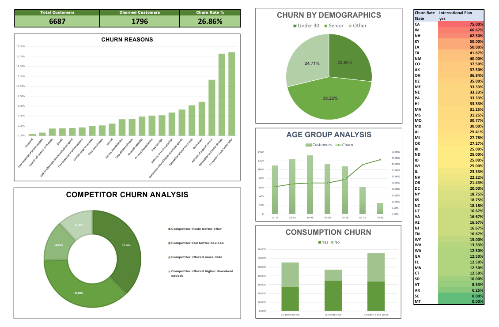

# Customer Churn Analysis & Recommendation in Excel

---

## 🎯 Project Overview

> This project analyzes a dataset of **6,670 subscribers** for the fictitious telecom company, Databel. The goal is to identify the key drivers of customer churn, visualize the findings in an interactive dashboard, and propose a data-driven retention strategy.

---

## 🛠️ Tools & Methodologies

* **Microsoft Excel**: Used for all stages of the analysis, including:
    * *Data Cleaning & Preparation*
    * *PivotTables & Calculated Fields*
    * *Advanced Charting (Combination & Clustered Column Charts)*
    * *Conditional Formatting*
    * *Interactive Dashboard Design*

* **Analysis**:
    * *Exploratory Data Analysis (EDA)*
    * *Customer Segmentation*
    * *KPI Monitoring*

---

## 📊 Analysis & Key Findings

The analysis focused on identifying customer segments with the highest propensity to churn.

* **Finding 1:** The overall customer churn rate for the company was **26.86%**.
* **Finding 2:** EDA revealed that the **'Senior'** demographic was the highest-risk segment, with a churn rate of **38.22%**—over **11 percentage points higher** than the company average.

---

## 🖥️ Interactive Dashboard

An interactive dashboard was created in Excel to visualize the key findings and provide a clear, at-a-glance overview of churn metrics across different customer segments.

---

## 💡 Recommendations

Based on the finding that seniors are a high-risk group, the primary recommendation is to **introduce a targeted 'Senior Saver' plan**.

This data-driven strategy could include simplified features and a lower price point to better meet the needs of this demographic. This initiative has the potential to **reduce churn in this key segment and retain over 80 customers annually**.
